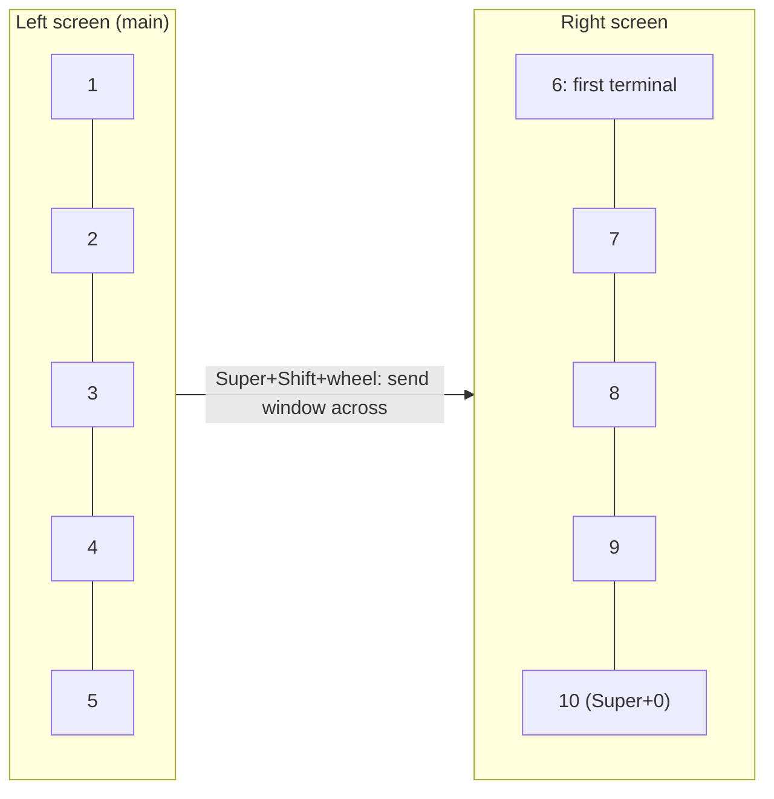

# Keybinds

`Super` is the Windows key. Everything here is bound in `config/binds.lua`; `tools/check_keybinds.py` fails CI if a key combo there is missing from this page.

## The two screens

Workspaces 1 to 5 live on the left screen (the main one), 6 to 10 on the right. `Super+1` ... `Super+9` and `Super+0` (10) go to a workspace, wherever it is; `Super+Shift+` the same number sends the focused window there. Screens are matched by serial number, so swapping cables never swaps them. With one screen unplugged, its workspaces move to the other and come back when it returns. On a laptop alone, all ten share its one screen.

## Apps

Keys marked "jumps" go to the app if it is already open and start it if not.

| Keys | Opens |
|---|---|
| ``Super+` `` | App search (launcher) |
| `Super+T` | kitty |
| `Super+F` | Ferdium (jumps) |
| `Super+W` | Windows desktop through WinApps: Office, OneDrive, FileMaker (jumps, or opens on an empty workspace) |
| `Super+O` | Obsidian (jumps; starts it if closed) |
| `Super+C` | Chrome, signed in, with tabs (jumps) |
| `Super+Shift+C` | Chrome incognito window (nothing saved) |
| `Super+D` | Discord in Vesktop (jumps; opens on an empty workspace of the right screen) |
| `Super+Shift+T` | Teams (jumps) |
| `Super+Shift+Z` | Zoom (jumps) |
| `Super+V` | VS Code (jumps) |
| `Super+B` | Calibre (jumps) |
| `Super+Y` | yazi file manager in its own kitty window (jumps) |
| `Super+Shift+M` | rmpc music player in its own kitty window (jumps) |
| `Super+P` | Bitwarden app (jumps) |
| `Super+Shift+P` | Bitwarden pop-up: pick a login, it is typed into the focused field |
| `Super+E` | Dolphin (files) |
| `Super+=` | Calculator (the keyboard's calculator key works too) |
| `Ctrl+Shift+Esc` | Mission Center task manager (jumps) |
| `Super+Shift+Esc` | btop (system monitor in a terminal) |

Kate and Virtual Machine Manager have no shortcut any more; open them from the app search.

## Windows

| Keys | Does |
|---|---|
| `Super+Tab` | Window switcher: all open windows, pick one |
| `Alt+Tab` | Cycle windows on the current workspace |
| `Super+Arrows` | Move focus to the window in that direction (crosses screens, works on an empty screen too) |
| `Super+Q` | Close window |
| `Super+Shift+Arrows` | Move window left / right / up / down |
| `Super+Shift+1` ... `0` | Send window to workspace 1 to 10 (and follow it) |
| `Super+Shift+` mouse wheel | Send window to the other screen |
| `Super+Enter` / `Super+F11` | Maximize / fullscreen |
| `Super+Alt+Space` | Float / tile |
| `Super+J` | Switch split: side by side or stacked |
| `Super+R` | Resize mode: arrows resize the focused window, `Shift`+arrows bigger steps, `Esc` or `Enter` to leave |
| `Super` + left mouse drag | Move window |
| `Super` + right mouse drag | Resize window |
| `Super+Escape` | Force-kill: then click the frozen window |

## Workspaces

Focus the window first (click it or hover it) before sending it anywhere.

| Keys | Does |
|---|---|
| `Super+1` ... `Super+0` | Go to workspace 1 to 10 (`0` is 10) |
| `Super+Shift+1` ... `0` | Send window to workspace 1 to 10 |
| `Super+Ctrl+1` ... `5` | Go to the 1st ... 5th workspace on this screen |
| `Super+Ctrl+Left/Right` | Previous / next workspace |
| `Super+Ctrl+` mouse wheel | Previous / next workspace on this screen |
| `Super+Alt+1` ... `5` | Go to workspace 1 to 5 (same as `Super+1` ... `5`) |
| `Super+Ctrl+Down` | Jump to an empty workspace |
| `Super+Shift+Ctrl+1` ... `5` | Move window to the 1st ... 5th workspace on this screen and follow it |
| `Super+Shift+Alt+1` ... `5` | Same, but stay where you are |
| `Super+Ctrl+Shift+Left/Right` | Move window to previous / next workspace |
| `Super+Ctrl+Shift+` mouse wheel | Move window to previous / next workspace |
| `Super+S` / `Super+Shift+S` | Show / send window to the hidden scratchpad |
| `Super` + mouse wheel | Scroll through workspaces |
| Click a pill in the bar | Go to that workspace |
| `Super` + left mouse drag | Drag a window anywhere, also onto the other screen |
| Four-finger swipe left/right (laptop touchpad) | Previous / next workspace |

## Desktop

| Keys | Does |
|---|---|
| `Super+Shift+V` | Clipboard history |
| `Super+.` | Emoji picker |
| `Print` / `Super+Print` | Screenshot a region / the whole screen |
| `Super+Alt+P` | Colour picker |
| `Super+A` | Notifications |
| `Super+Shift+N` | Do not disturb on / off |
| `Super+Shift+H` | Hide / show the top bar |
| `Super+X` | Control centre |
| `Super+Z` | Noctalia settings |
| `Super+Shift+W` | Wallpaper |
| `Super+L` | Lock (the h1n054ur lock screen, see quickshell-h1n054ur) |
| `Super+Alt+C` | Session menu, also the power icon on the bar: 1 lock, 2 log out, 3 sleep, 4 restart, 5 shut down (3 to 5 count down 3 s, Esc cancels) |
| `Super+Minus` / `Super+Plus` | Zoom out / in |
| `Super+/` | Searchable keybind cheat sheet |

## Inside kitty

| Keys | Does |
|---|---|
| `Ctrl+Shift+T` | New tab (same folder) |
| `Ctrl+Tab` / `Ctrl+Shift+Tab` | Next / previous tab |
| `Ctrl+Shift+D` | Move tab into its own window (or drag the tab out) |
| `Ctrl+Shift+Q` | Close tab |
| `Ctrl+Alt+Shift+T` | Rename tab |
| `Ctrl+Shift+Enter` | Split horizontally |
| `Ctrl+Shift+\` | Split vertically |
| `Ctrl+Shift+Arrows` | Move between splits |
| `Ctrl+Shift+Z` | Zoom one split (toggle) |
| `Ctrl+Shift+R` | Resize splits (`W` wider, `N` narrower, `T` taller, `S` shorter, `Esc` done) |
| `Ctrl+Shift+W` | Close split |
| `Ctrl+C` / `Ctrl+V` | Copy (when text is selected) / paste |
| `Ctrl+Shift+/` | Search the scrollback |
| `Ctrl+Shift+K` / `J` | Scroll up / down |
| `Ctrl+Shift+=` / `-` / `Backspace` | Bigger / smaller / reset text |
| `Ctrl+Shift+Y` | yazi (files) in a new tab |
| `Ctrl+Shift+M` | Music (rmpc) in a new tab |
| `Ctrl+Shift+E` | Open a link on screen |
| `Ctrl+Shift+F5` | Reload kitty config |

## Dolphin

| Keys | Does |
|---|---|
| `F4` | Terminal panel (follows the folder you are in) |
| `F3` | Split into two panes |
| `Ctrl+T` | New tab |

## Shell

| Type | Does |
|---|---|
| `y` | File manager, cd to wherever you quit |
| `z <part of folder name>` | Jump to a folder you have visited |
| `Ctrl+R` | Search command history |
| `Ctrl+T` | Pick a file into the command |
