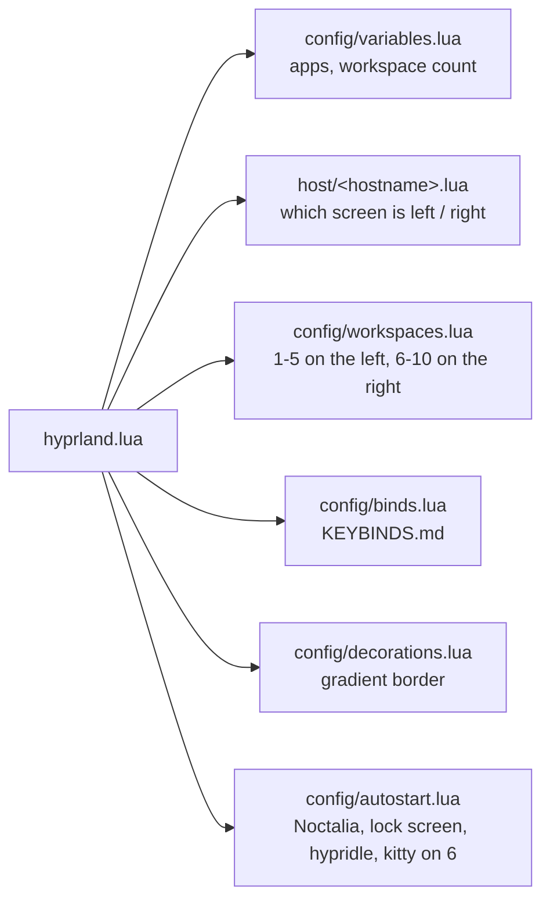

# h1n054ur Hyprland config

My [Hyprland](https://hypr.land) setup in the Lua config format (Hyprland 0.55 and newer): ten fixed workspaces split over two screens, keybinds that jump to an app when it is open and start it when it isn't, and a green-to-cyan border on the focused window. It runs under [uwsm](https://github.com/Vladimir-csp/uwsm) with the [Noctalia](https://github.com/noctalia-dev/noctalia) shell.


## Two screens

| | Left screen (main) | Right screen |
|---|---|---|
| Workspaces | 1 to 5 | 6 to 10 |
| Starts with | Ferdium on 1 | the first kitty on 6 |
| Bar | the full bar: search, clock, weather, stats, volume, network, power | a slim bar: Claude sessions, tray |
| Login screen | the sign-in panel | the clock |

Each workspace is pinned to its screen (`config/workspaces.lua`), so `Super+1` to `Super+0` always land on the same physical screen. Screens are matched by description (make, model, serial) in `host/<hostname>.lua`, not by port: swapping cables never swaps them. If a screen is unplugged, its workspaces move to the other one and come back when it returns. A laptop on its own screen keeps all ten.



## Keybinds


[KEYBINDS.md](KEYBINDS.md) has all of them, grouped: apps, windows, workspaces, desktop, and the keys inside kitty and Dolphin. Most app keys **jump**: if the app is open you go to it, wherever it is; if not, it starts. `tools/check_keybinds.py` fails CI when a bind in `config/binds.lua` is missing from that page, so the two never drift apart.

## Install

```sh
git clone https://github.com/h1n054ur/hyprland-h1n054ur ~/.config/hypr
cp ~/.config/hypr/host/example.lua ~/.config/hypr/host/"$(cat /etc/hostname)".lua
```

Then edit your host file: put your screens' descriptions from `hyprctl monitors` in `MAIN_SCREEN` (left, the main one) and `SIDE_SCREEN` (right), and their positions. `Hyprland --verify-config` checks the result. The apps the binds start come from [h1n054ur-setup](https://github.com/h1n054ur/h1n054ur-setup); the lock screen and session menu from [quickshell-h1n054ur](https://github.com/h1n054ur/quickshell-h1n054ur).

## What's here

| Path | What |
|---|---|
| `hyprland.lua` | loads everything below, plus `host/<hostname>.lua` |
| `config/variables.lua` | terminal, file manager, browser, editor; where the first kitty opens |
| `config/workspaces.lua` | workspaces 1-10 pinned to the two screens |
| `config/binds.lua` | every keybind (bound by keycode, so other layouts work too) |
| `config/autostart.lua` | Noctalia, the h1n054ur lock screen and session menu, hypridle, the first kitty |
| `config/decorations.lua` | gaps, the `#39ff14` to `#00e5ff` border, blur |
| `config/windowrules.lua` | where apps open, floating dialogs, WinApps tiling |
| `host/example.lua`, `host/laptop.lua` | per-machine screens |
| `KEYBINDS.md`, `tools/check_keybinds.py` | the keybind list and its check |

## Part of h1n054ur/desktop

This repo is generated from the `hyprland/` folder of [h1n054ur/desktop](https://github.com/h1n054ur/desktop). It is read-only: open issues and pull requests there.

## Licence

MIT, see [LICENSE](LICENSE).
